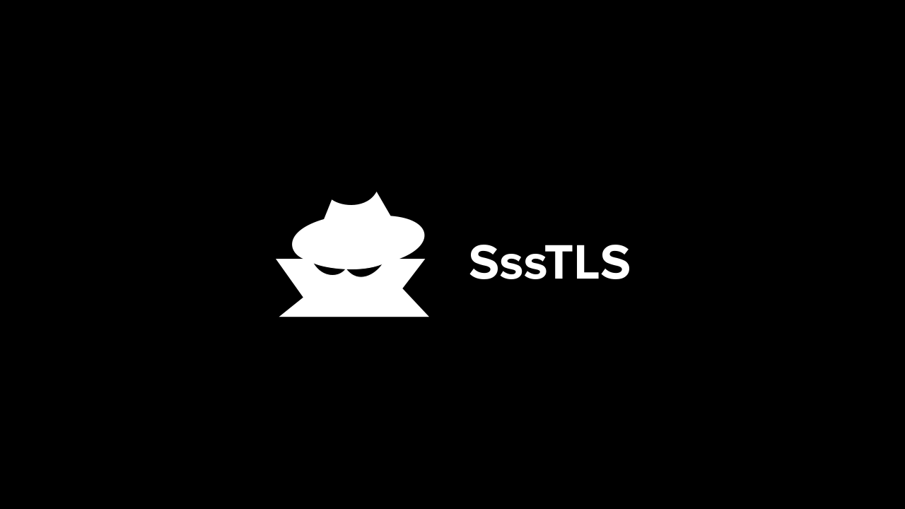

# SssTLS


<br>

Golang library to spoof Ja3 fingeprints compatible with standart http interface. Inspired with [CycleTLS](https://github.com/Danny-Dasilva/CycleTLS/tree/main) and [ja3transport](https://github.com/cucyber/JA3Transport)

# example [[ssstls_test.go](ssstls_test.go)]

```go
// ..
const (
	ja3      = "771,4865-4866-4867-49196-49195-52393-49200-49199-52392-49162-49161-49172-49171-157-156-53-47-49160-49170-10,0-23-65281-10-11-16-5-13-18-51-45-43-27,29-23-24-25,0"
	ua       = "Mozilla/5.0 (Macintosh; Intel Mac OS X 10_15_7) AppleWebKit/537.36 (KHTML, like Gecko) Chrome/112.0.0.0 Safari/537.36"
	// ..

	ja3ZoneUrl  = "https://check.ja3.zone/"
	// ..
)

type ja3ZoneRes struct {
	Fingerprint string `json:"fingerprint"`
}

func TestJa3HTTP1(t *testing.T) {
	transport := ssstransport.NewTransport(ja3, ua)
	// create custom http client with spoofed ja3's
	client := http.Client{Transport: &transport}

	// make req and unmarshal json to struct
	data, err := makeReq[ja3ZoneRes](&client, ja3ZoneUrl)
	if err != nil {
		t.Fatalf("make request: %v", err)
	}

	t.Log(data.Fingerprint)

	// check if ja3's differ
	if data.Fingerprint != ja3 {
		t.Fatalf("ja3's differ")
	}
}
```